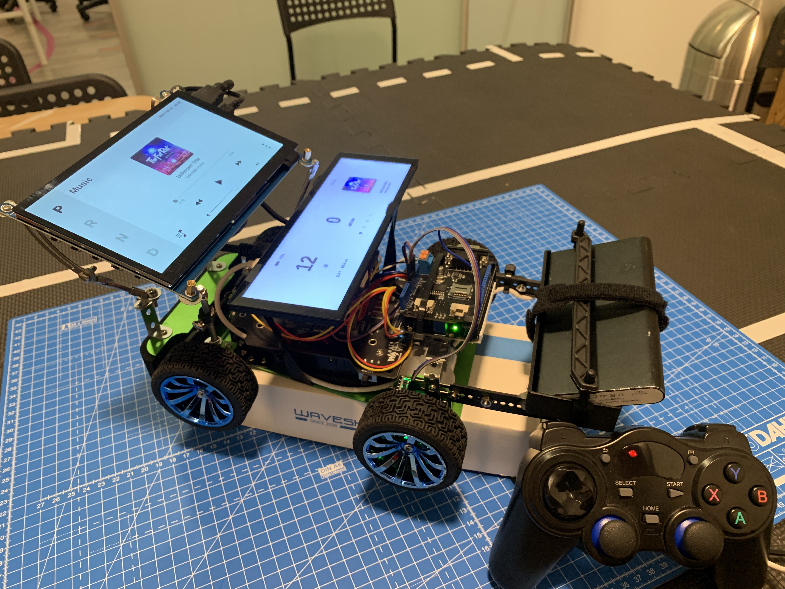
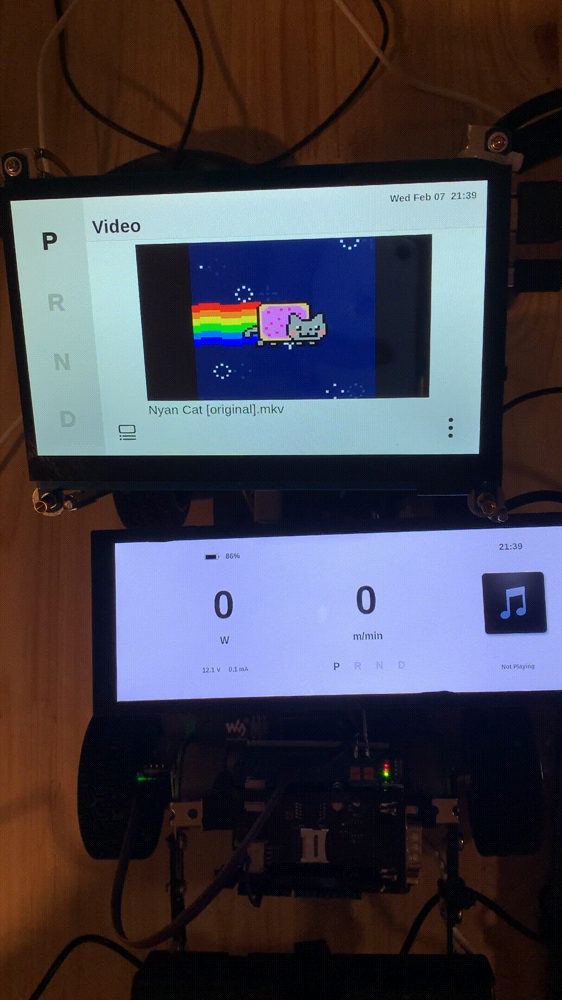
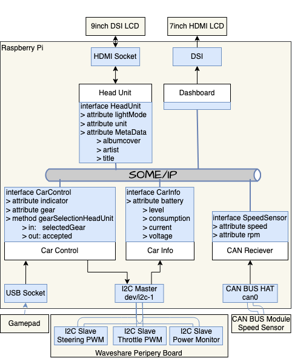
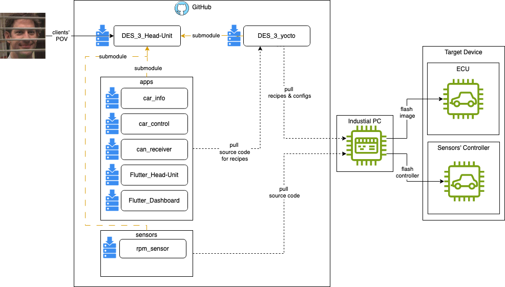

# DES03 Project - Head Unit

## Table of contents
  - [Introduction](#introduction)
  - [Collaborators](#collaborators)
  - [Demonstration](#demonstration)
  - [Project Structure](#project-structure)
  - [Architecture](#architecture)
  - [Documentation](#documentation)

## Introduction
This project is part of the [embedded software development cirriculum at SEA-ME](https://github.com/SEA-ME/DES_Head-Unit).  

It aims to develop a **Head Unit application** running on a ECU alongside the a **Instrument Cluster application** in Flutter.   
The Head Unit application will provide features like **ambient lighting, gear selection, and a media app**.   
Furthermore, the project uses **Scalable Service-Oriented Middleware (vSOME/IP)** for the in-vehicle communication and **Yocto as the build system** for the ECU.   

  

## Collaborators
If you find any kinds of bugs or issues, please contact 
[Kian](https://github.com/kianwasabi), 
[Jinhong](https://github.com/Lagavulin9) or 
[Seungwoo](https://github.com/SeungWoo-L). 👌🏽

## Demonstration

The following videos demonstrate the features of the project.  

A Media Player, that plays various media resources like musik or video from a USB storage.  
The played media meta data is also displayed on the dashboard.  

  
Ambient Lighting Control:  
  
Gear Selection through the gamepad or the Head-Unit.:  

  

## Architecture
The following image gives a brief overview about the [software structure](/documentation/software_structure.md) that runs on the cars' [system structure](/documentation/system_structure.md).  
Each application like head-unit, dashboard, can_receiver, car_control, and car_info serves a different purpose and uses different peripheral interfaces and devices.   
BMWs' [CommonAPI](/documentation/common_api.md) ensure the communication between the applications via Scalable Service-Oriented Middleware over IP (SOME/IP). It is easy to add more apps to the system by using the [CI/CD workflows for CommonAPI](/documentation/workflows.md) we build.  
In the current setup, the [speed sensor](/documentation/rpm_speedsensor.md) is the only sensor that feeds the cars' [CAN bus](/documentation/can_bus.md) but it can seamlessly be extended by adding more sensors to the CAN bus.  
The system operates with a custom-made Yocto Image deployed on the Raspberry Pi ECUs. 

  

## Project Structure & CI/CD

The following image shows the project structure for the DES3 Head-Unit project.  
- `apps`: contains submodules which hold the source code to run the car.   
- `sensors`: contains submodules for the sensors' controllers that feed vehicle CAN bus.  
- `image`: contains a submodule that provides config files and recipes to bitbake the vehicles' ECU yocto image. _(Note: The bitbake recipes are fetching the apps' source code from the submodules' repositories.)_ 
- `documentation`: summarizes all the projects' documentation.  

**Continuous Integration**: Happens in the apps'and sensors' submodules.  

**Continous Delivery**: To roll out the software, the sensors' controller and the ECU needs to be flashed.   
- `sensors` 
  - Clone DES_3_Head-Unit repository.  
  - Choose the sensors' directory from the sensors folder.  
  - Flash the sensors' controller using the Arduino IDE.  
- `image`
  - Clone DES_3_yocto repository.  
  - Bitbake the yocto image.  
  - Flash the yocto image on the ECU by loading the it on the RPis' SD-Card.  

  

> _The development in each submodule is done individually by the assigned developer.  
Once a feature is ready, a new release following the teams' [conventions](/documentation/project_conventions.md) is published._  

## Documentation
As mentioned above, the `documentation` folder contains all the projects' documentation. The files are distinguished by the phases the project went through. If you seek for more informations, don't hesitate to read through the following docs.  
 
1) Requirements Gathering: 
  - [🧑🏽‍🏫 subject](/documentation/subject.md) 
  - [📝 project requirments](/documentation/project_requirments.md)
2) Planning Design, System & Software:
  - [🧑🏽‍🎨 frontend design](/documentation/design.md)
  - [🏎 system structure](/documentation/system_structure.md)
  - [👨🏽‍💻 software structure](/documentation/software_structure.md)
3) Team Collaboration:
  - [🔓 conventions](/documentation/project_conventions.md)
  - [📋 kanban board](https://github.com/users/Lagavulin9/projects/2)
4) Integration:  
    - Technologies:
      - [⬅️ CAN bus](/documentation/can_bus.md)
      - [🔛 vSOME/IP & CommonAPI](/documentation/common_api.md)
      - [🤖 Github workflow](/documentation/workflows.md)
      - [🍪 Yocto](/documentation/yocto.md)
    - Applications: 
      - [1️⃣ headunit](https://github.com/Lagavulin9/Flutter_Head-Unit/blob/ed77898863735f600a42c81f6de45130858950b2/README.md)
      - [2️⃣ dashboard](https://github.com/Lagavulin9/Flutter_Dashboard/blob/adaeac6cd07b3fc907f53d9e795a4e1962c6683c/README.md)
      - [3️⃣ can_bus receiver](https://github.com/SeungWoo-L/can_receiver/blob/63a2b949d78a1b416df0a685942f927e3a261262/README.md)
      - [4️⃣ car control](https://github.com/kianwasabi/car_control/blob/5758c1ca57c1065f2996c0ed6cb1e277471c6838/README.md)
      - [5️⃣ battery information](https://github.com/kianwasabi/car_info/blob/46cf197c9abdbb2bb29a31db5f104c5aca2507c4/README.md)
    - Sensors:  
      - [6️⃣ rpm speed sensor](https://github.com/kianwasabi/rpm_sensor/blob/15d63ddbcfaa7330290a05cedc7fac5c75453a97/README.md)
5) Testing: 
  - [📝 test requirments](/documentation/project-requirments.md)
