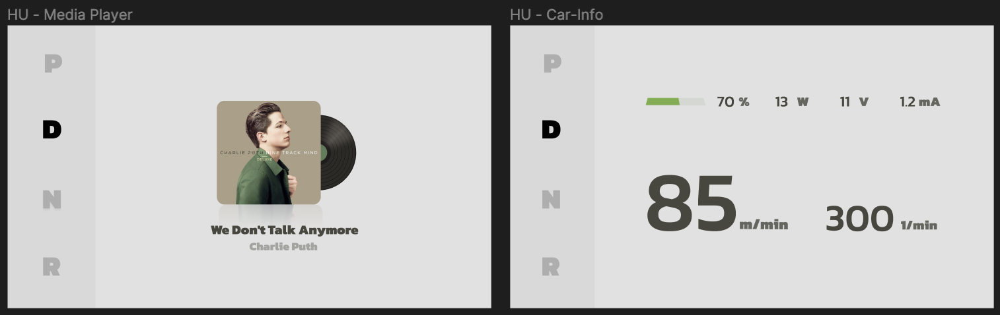

# Design & User Stories

## Table of Contents
- [Intro](#intro)
- [Dashboard](#dashboard)
- [Head Unit](#head-unit)
 

## Intro

This is the design for the new head unit and dashboard.  
Designs are made in [Figma](https://www.figma.com/file/mVfEtLbcduyV5czodVTCHv/HMI-Cluster-Design-(Community)?type=design&node-id=104%3A12&mode=design&t=MNUstrlhuIIZIg9A-1). Click the link to view the current design.  
The design is based on the [user requirements](../project-requirements.md#user-requirements) and [system requirements](../project-requirements.md#system-requirements).  

💡 If you have suggestions to enhance the design, do not hesitate to contact us.  

## Dashboard 
The image below shows the dashboard.  
It is split into **three** parts.  
- **Left:** Car related informations like battery level.  
- **Middle:** Driving relevant informations like speed and the gear selection.  
- **Right:** Media Player  

 

## Head Unit 
**Left:**  Gear Selection (selected by touch input)  
**Right:** The user can swipe through **three** features. 
- First:  Media Player  
- Second: Car Info
- Third:  Ambiente lights

 
 

