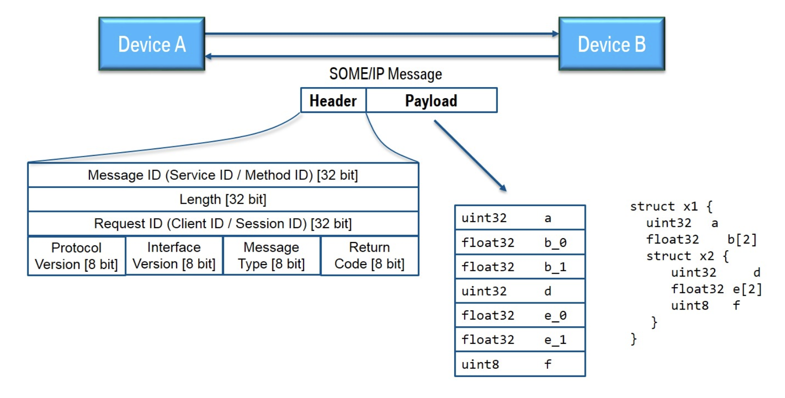
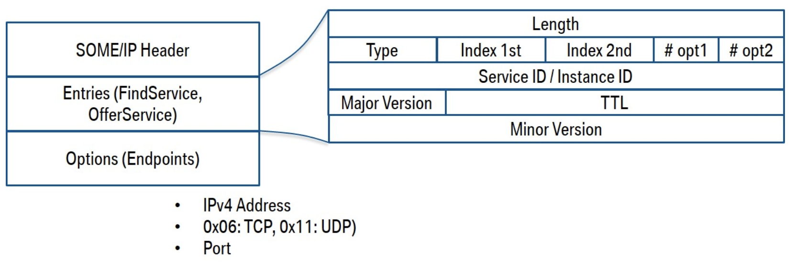

# Common API

!! UNDER CONSTRUCTION !! <br>

## Table of Contents
- [Introduction](##Introduction)
- [Fundamentals](##Fundamentals)
- [Project Notation](##Project-Notation)

## Introduction
CommonAPI is a middleware developed by the GENIVI Alliance. <br>
It is a framework that allows the development of in-vehicle infotainment (IVI) applications. It is based on the concept of service-oriented architecture (SOA) and provides a service-oriented middleware (SOM) that allows the development of applications independently of the underlying communication technology. 
CommonAPI is an abstraction layer over Inter-Process communication (IPC) protocols,specifically, SOME/IP and DBus. In this project the SOME/IP protocol was used.

_Note: If you have no knowledge about CommonAPI, vSOME/IP and Franca, we recommend to read the following [CommonAPI user guide] first._

## Fundamentals
### SOME/IP
SOME/IP is an abbreviation for "Scalable service-Oriented middleware  over IP". This middleware was designed for typical automotive use cases and for being compatible with AUTOSAR (at least on the wire-format level). A publicly accessible specification is available at http://some-ip.com/. In this wiki we do not want to deepen further into the reasons for another middleware specification, but want to give a rough overview about the basic structures of the SOME/IP specification and its open source implementation vsomeip without any claim of completeness. <br>
Let's start with the three main parts of the SOME/IP specification:
On-wire format, Protocol and Service Discovery. <br>

#### On-Wire Format
In principle, vSOME/IP communication consists of messages sent between devices or subscribers over IP. Consider the following picture:



There you see two devices (A and B); Device A sends a SOME/IP message to B and gets one message back. The underlying transport protocol can be TCP or UDP; for the message itself this makes no difference. Now we assume that on device B is running a service which offers a function that is called from device A by this message and the message back is the answer.

SOME/IP messages have two parts: header and payload. In the picture you see that the header consists mainly of identifiers:

    - Service ID: unique identifier for each service
    - Method ID: 0-32767 for methods, 32768-65535 for events
    - Length: length of payload in byte (covers also the next IDs, that means 8 additional bytes)
    - Client ID: unique identifier for the calling client inside the ECU; has to be unique in the overall vehicle
    Session ID: identifier for session handling; has to be incremented for each call
    - Protocol Version: 0x01
    - Interface Version: major version of the service interface
    - Message Type: 
        -- REQUEST (0x00) A request expecting a response (even void) 
        -- REQUEST_NO_RETURN (0x01) A fire&forget request 
        -- NOTIFICATION (0x02) A request of a notification/event callback expecting no response 
        -- RESPONSE (0x80) The response message
    Return Code: 
        -- E_OK (0x00) No error occurred 
        -- E_NOT_OK (0x01) An unspecified error occurred 
        -- E_WRONG_INTERFACE_VERSION (0x08) Interface version mismatch -- E_MALFORMED_MESSAGE (0x09) Deserialization error, so that payload cannot be deseria-lized 
        -- E_WRONG_MESSAGE_TYPE (0x0A) An unexpected message type was received (e.g. RE-QUEST_NO_RETURN for a method defined as RE-QUEST)

We see that there are "REQUESTs" and "RESPONSEs" for normal function calls and notification messages for events to which the client has been subscribed. Errors are reported as normal responses or notifications but with an appropriate return code.

The payload contains the serialized data. The picture shows the serialization in the simple case that the transmitted data structure is a nested structure with only base data types. In this case it is easy: the struct elements are just flattened, that means that they are simply written one after the other into the payload.


As shown in the picture vsomeip covers not only the SOME/IP communication between devices (external communication) but also the internal inter process communication. Two devices communicate via so-called communication endpoints which determine the used transport protocol (TCP or UDP) and its parameters as the port number or other parameters. All these parameters are configuration parameters which can be set in a vsomeip configuration file (json file, see vsomeip user guide). The internal communication is done via local endpoints which are implemented by unix domain sockets using the Boost.Asio library. Since this internal communication is not routed via a central component (e.g. like the D-Bus daemon), it is very fast.

The central vsomeip routing manager gets messages only if they have to be sent to external devices and he distributes the messages coming from outside. There is only one routing manager per device; if nothing is configured the first running vsomeip application also starts the routing manager.

The SOME/IP Service Discovery is used to locate service instances and to detect if service instances are running as well as implementing the Publish/Subscribe handling. This is mainly done via so-called offer messages; that means that each device broadcasts (multicasts) messages which contain all the services which are offered by this device. SOME/IP SD messages are sent via UDP. If services are required by client applications but at the moment not offered, then also "find messages" can be sent. Other SOME/IP SD messages can be used for publishing or subscribing an eventgroup.

The following picture shows the general structure of a SOME/IP SD message.



This should be enough for the beginning. More details are discussed later in the examples or can be read in the specification.

### vsomeip 
Before we start to implement the introductory example, let's have a short look to the basic structure of the GENIVI implementation of SOME/IP which is called vsomeip.

vSOME/IP does not implement the serialization of data structures. This is covered by the SOME/IP binding of CommonAPI. <br>
vSOME/IP just covers the SOME/IP protocol and the Service Discovery.<br>

Further details are explained directly in the examples on Github.

### CommonAPI
CommonAPI is a framework that allows the development of in-vehicle infotainment (IVI) applications via the concept of service-oriented architecture (SOA). This service-oriented middleware (SOM) allows the development of applications independently of the underlying communication technology. <br>

!! put picture of CommonAPI Architecture here (see CommonAPI user guide) !!

## Project Notation 
For this project the SOME/IP bining is used. 
To establish a reliable communication between the applications, the follwing notation between the applications is used. <br>
The used notation on the vSOME/IP interface is set in the dfidl files of each application. <br>

### Convention 

Usually, on-board networks like AUTOSAR use a clearly defined notation. (!! insert AUTOSAR DOC LINK here !!)

In this project, the following (light weighted) notation is used: <br>

- Every application is assigned to a unique sequence number. 
    - 1 = Head_Unit 
    - 2 = Dashboard 
    - 3 = Can_Receiver
    - 4 = Car_Control 
    - 5 = Car_Info
- All IDs in the CommonAPI interface definition (fidl) are structured like this: 
    - 0x | Appication number | Eventgroup ID | Event ID | 
- Reliable mode should always be activated.
- This Project runs on a single ECU. Therfore, it is sufficent to run all services on the same IP adrress. The services of each application are differed by the port number. 
    - Network: 
        - IP: 192.168.0.2 
        - Port: Starts with applications number and ends with 0 or 1. 
            - 0 = Reliable
            - 1 = Unreliable

#### 1) Head_Unit Application

```yaml
    test
```

#### 2) Dashboard Application

```yaml
    test
```

#### 3) Can Receiver Application

```yaml
interface Speed_Sensor:
SomeIpServiceID = 0x3000
    attribute speed 
        SomeIpGetterID              = 0x3101
        SomeIpSetterID              = 0x3102
        SomeIpNotifierID            = 33104
        SomeIpAttributeReliable     = false
        SomeIpNotifierEventGroups   = 33104
    attribute rpm 
        SomeIpGetterID              = 0x3201
        SomeIpSetterID              = 0x3202
        SomeIpNotifierID            = 33204
        SomeIpAttributeReliable     = false
        SomeIpNotifierEventGroups   = 33204
Service:
        InstanceId = "Speed_Sensor"
        SomeIpInstanceID = 22000
```
#### 4) Car Control Application

```yaml
Service commonapi.CarControl: 
SomeIpServiceID = 4000
    attribute indicator:
        SomeIpNotifierEventGroups   = 4100
        SomeIpNotifierID            = 41000
        SomeIpGetterID              = 4101
        SomeIpAttributeReliable     = true
    attribute gear:
        SomeIpNotifierEventGroups   = 4200 
        SomeIpNotifierID            = 42000
        SomeIpGetterID              = 4201
    method gearSelectionHeadUnit:
        SomeIpMethodID              = 4200
Service: 
        InstanceId                  = commonapi.CarControl
        SomeIpInstanceID            = 4001
        SomeIpUnicastAddress        = 192.168.0.2
        SomeIpReliableUnicastPort   = 40010
        SomeIpUnreliableUnicastPort = 40011
```

#### 5) Car Info Application

```yaml
interface commonapi.CarInfo:
SomeIpServiceID = 5000
    attribute battery
        SomeIpNotifierEventGroups   = 5100
        SomeIpNotifierID            = 51000
        SomeIpGetterID              = 5101
        SomeIpAttributeReliable     = true
Service:
    InstanceId                      = commonapi.CarInfo
    SomeIpInstanceID                = 5001
    SomeIpUnicastAddress            = 192.168.0.2
    SomeIpReliableUnicastPort       = 50010
    SomeIpUnreliableUnicastPort     = 50011
```

## Target Device Setup

To make CommonAPI with the SOME/IP bindig work on the single ECU setup, the following steps are required.

### Install Dependencies
The Java 8, Boost-dev, libdbus, and ascii libaries are required. See the vSOME/IP documentations for more informations. 
```bash
sudo apt update
sudo apt install openjdk-8-jdk
sudo apt-get install libboost-all-dev
sudo apt-get install libdbus-1-dev
sudo apt install ascii
```
Additionally, the piracer's drivetrain and battery control unit needs a few python dependencies that are available in the piracer-py package. <br>
Therefore, install the piracer-py package globally.
```bash
pip install piracer-py
```

### Build & Install the CommonAPI Core Runtime Library
```bash
cd ~
git clone https://github.com/GENIVI/capicxx-core-runtime.git
cd capicxx-core-runtime/
mkdir build
cd build
cmake ..
make 
sudo make install
```

### Build & Install the vSOME/IP Library
```bash
cd ~
git clone https://github.com/COVESA/vsomeip.git
cd vsomeip
mkdir build
cd build
cmake -DENABLE_SIGNAL_HANDLING=1 -DDIAGNOSIS_ADDRESS=0x10 ..
make
sudo make install
```

### Build the CommonAPI vSOME/IP Runtime Library
```bash
git clone https://github.com/GENIVI/capicxx-someip-runtime.git
cd capicxx-someip-runtime
mkdir build
cd build
cmake -DUSE_INSTALLED_COMMONAPI=OFF ..
make
sudo make install
```

### Write the Franca file 
Time to start building your application by define your interface. 

### Generate Code with the CommonAPI Generator
Unfortunately, code generator [doesn’t support arm architecture.]((https://github.com/COVESA/capicxx-core-tools/issues/19)). <br>
So if you want to use the generator, we recommend to use your own non-aarm machine. A more comfortable approach would be github actions. <br>
For this we developed a tool called [capicxx-tools-CI-CD] which is available in the SEA:ME's GitHub. <br>
The code generator automatically generates codes according to fidl and fdepl files. <br>

The generators itself are relatily easy to use. Just download from Github, unzip and run the executable like in the example below. <br>
```bash
/home/seame02/generator/core-generator/commonapi-core-generator-linux-x86_64 -sk ./fidl/carinfo.fidl -d ./src-gen-carinfo/core
/home/seame02/generator/someip-generator/commonapi-someip-generator-linux-x86_64  ./fidl/carinfo.fdepl -d ./src-gen-carinfo/someip
```

Once the code is generated, you can use StubImpl to implement your Service and the Proxy files to build your clients. <br>

## Neat to know
### Binding to vSOME/IP 
CommonAPI's available bindings (dbus or vSOME/IP) can be configured by ini-files. <br>
The CommonAPI configuration file is commonapi.ini. There are three places where CommonAPI Runtime tries to find this
file (in the following order): <br>
1. in the directory of the current executable. If there is a commonapi.ini file, it has the highest priority.
2. in the directory which is specified by the environment variable COMMONAPI_CONFIG.
3. in the global default directory /etc.
The configuration file has 4 possible sections; all sections are optional.
The default default binding is "dbus". This can be changed by setting the "binding" variable in the "default"-section of the CommonAPI configuration file or by setting the environment variable "COMMONAPI_DEFAULT_BINDING". The environment variable overwrites the setting provided by the configuration file.

---

## Reference
- [SOME/IP](http://some-ip.com/)
- [CommonAPI SomeIP in 10-minutes](https://github.com/COVESA/capicxx-someip-tools/wiki/CommonAPI-C---SomeIP-in-10-minutes)
- [How to Install Java on Raspberry Pi](https://phoenixnap.com/kb/install-java-raspberry-pi#ftoc-heading-4)
- [How to install latest Boost library on Raspberry Pi](http://osdevlab.blogspot.com/2016/02/how-to-install-latest-boost-library-on.html)
- [CommonAPI C++ User Guide](https://usermanual.wiki/Document/CommonAPICppUserGuide.113855339.pdf)
- [CommonAPI user guide](https://usermanual.wiki/Document/CommonAPICppUserGuide.113855339.pdf)
- [Moon's well written CommonAPI tutorial](https://github.com/SEA-ME/Team-Pilot/tree/Moon/Project-2/CommonAPI-vSomeIP)
- [CommonAPI vSOME/IP Examples](https://github.com/Pelagicore/common-api-tools/tree/master/CommonAPI-Examples)
- [CommonAPI core tool](https://github.com/COVESA/capicxx-core-tools)
- [CommonAPI vSOME/IP tool](https://github.com/COVESA/capicxx-someip-tools)
- [capicxx-tools-CI-CD](https://github.com/SEA-ME/capicxx-tools-CI-CD)
- [unix ini file](http://en.wikipedia.org/wiki/INI_file)