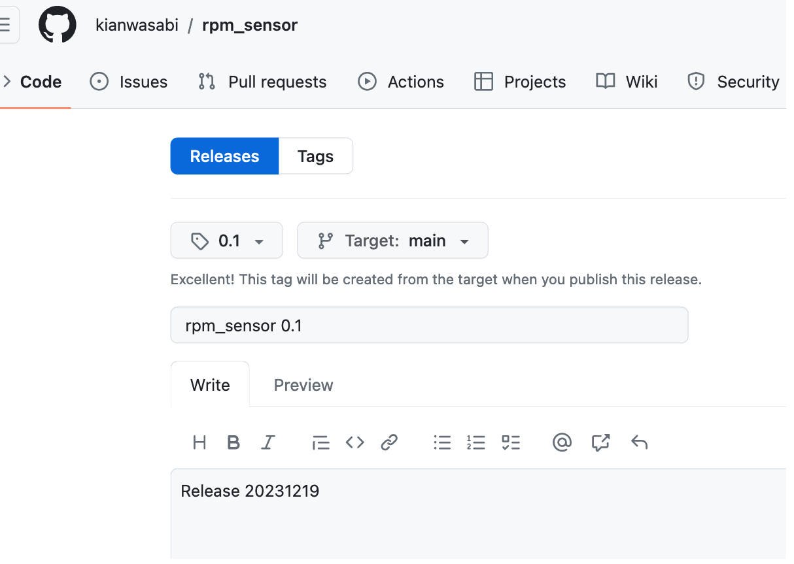

# Project Conventions

## Table of contents
- [Releases](#releases)
- [Namespace within Github](#namespace-within-github)
- [Coding Style](#coding-style)

## Releases   
- In Submodules (apps, sensors, image)
- release tag: 
    - V + Major + Minor
        - Major: Project number
            - 0: DES_03
            - 1: DES_04
            - 2: DES_05
            - ... 
        - Minor: Release number
            - depentes on developer. For instance once a few kanban card are done or a feature is ready.
    - Example:
        - V0.1, V0.2, ... 
- release name: 
    - repository name + release tag
- release description: 
    - Kanban card name + Kanban card description
    - Example:
        - Kanban card name: "Implement the CommonAPI"
        - Kanban card description: "Implement the CommonAPI in the head unit and the dashboard"
        - release description: "Implement the CommonAPI in the head unit and the dashboard"

Example:  
  

Once a feature is ready, notify the team and publish a new release.

## Namespace within Github
It is recommended to use **snake_case** for 
- file names  
- folder names  
- repo names  

## Coding Style
It is recommended to use **camelCase** for 
- variable names  

It is recommended to use **PascalCase** 
- class names  
- struct names  
- enum names  

It is recommended to use **UPPER_CASE** 
- constants  

