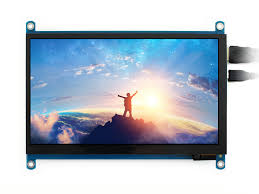

# System Structure
This section describes the hardware and system architecture of the PiRacer & the Head Unit. 

## Componentens
The following tables displays all components and its datasheets that are used for this project.  
| Car | Gamepad | Dashboard | Head Unit | Raspberry Pi | CAN Hat | CAN Hat | Arduino Uno | Speed Sensor |
|:-------:|:-------:|:-------:|:-------:|:-------:|:-------------------:|:-------:|:-----------:|:------------------:|
||||||||||
| [PiRacer Base](https://www.waveshare.com/piracer-ai-kit.htm)| [ShanWan Wireless Gamepad]() |[Waveshare 9inch DSI LCD](https://www.waveshare.com/wiki/7.9inch_DSI_LCD)|[Waveshare 7inch HDMI LCD](https://www.waveshare.com/wiki/7inch_HDMI_LCD_(C))|[Raspberry Pi 4](LINK)|[RPI 2CH CAN HAT](https://www.waveshare.com/wiki/2-CH_CAN_HAT)|[Arduino Uno 1CH CAN HAT](LINK)|[Arduino Uno](LINK)|[LM393](LINK)|

## Assembly
This is how the assembled PiRacer looks like:

Note : The Camera is mounted to at the rear of the PiRacer.

## Wiring
The following tables are showing the wiring & connection of all Componentens.

### Sensor Sensor @ Arduino Uno
| LM393 | Arduino | 
|:--------------------:|:-------:|
| VCC                  | 5V      | 
| GND                  | GND     | 
| OUT                  | D3      | 

### Arduino Uno @ Arduino Uno 1CH CAN HAT
The CAN HAT can directly be mounted on the Arduino Uno.  

### Arduino Uno 1CH CAN HAT @ RPI 2 CH CAN HAT
Chanel 1 (L & H) is used for the **CAN communication** between the Arduino Uno CAN HAT and the Raspberry Pi CAN HAT.  

### PRi @ RPi 2 CH CAN HAT
The CAN HAT is connected to the Raspberry Pi 4 via the **SPI** interface.  

### RPi @ PiRacer Drivetrain
The drivetrain of the PiRacer is connected via **I2C** with the Raspberry Pi 4.

### RPi @ Head Unit
**USB** for touch input and power supply as well as **HDMI** for the video input are used to connect the Raspberry Pi 4 with the Head Unit.

### RPi @ Dashboard
The LCD Display is connected on the Raspberry Pi using the **DSI** connector.  
The Power (5V) is supplied via the GPIO pins.  
**I2C** is used to get the touchscreen input.  

