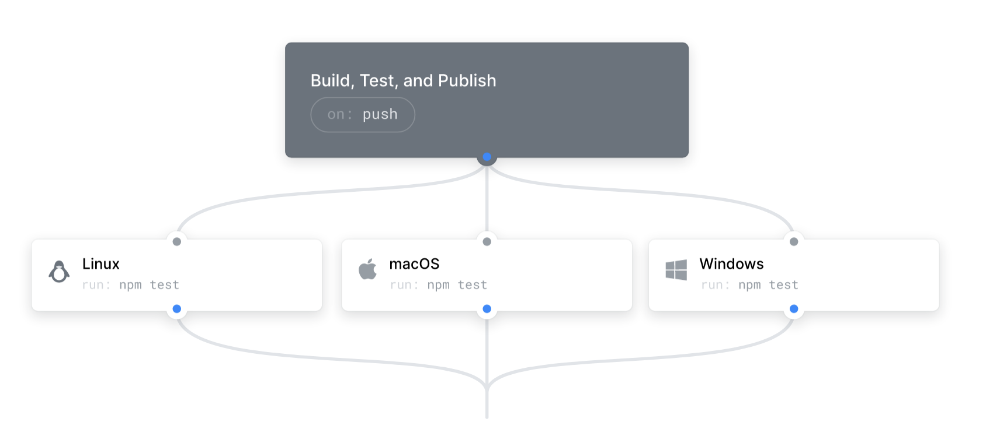

# Workflows

!! UNDER CONSTRUCTION !! <br>

## Table of Contents
- [Introduction](##Introduction)
- [CommonAPI Code Generator Workflow](##CommonAPI-Code-Generator-Workflow)

## Introduction
GitHub Actions is a feature provided by GitHub that allows you to automate, customize, and execute your software development workflows right in your repository. You can think of it as a CI/CD (Continuous Integration/Continuous Deployment) tool that is integrated directly into GitHub. <br>

With GitHub Actions, you can create workflows that respond to various GitHub events such as pushing code, creating pull requests, or raising issues. These workflows are composed of one or more jobs, and each job consists of a series of steps that perform individual tasks. Steps can run commands, run setup tasks, or run an action in your repository. <br>

GitHub Actions supports workflows that run on Linux, Windows, and macOS virtual machines, and also provides a rich marketplace of pre-built actions that you can use in your workflows. <br>

In the context of your document, it seems like GitHub Actions is being used to automatically generate code when changes are pushed to the repository. This is a common use case for GitHub Actions, as it can help to ensure that your generated code is always up-to-date with your source code. <br>



## CommonAPI Code Generator Workflow
To use the convesa's commonAPI auto generated code is required. <br> 
The code can be generated by using the github action workflows that are defined in the .github/workflows folder. <br>

- 1) Modify the .fidl or .fdepl file, than commit and push to remote reposity. <br>

```bash 
git add .
git commit -m "fidl file changed"
git push
```

The github workflow will generate the code and push it in the folder "src-gen". <br> 
After the code is generated, pull from remote repository. <br>

```bash 
git pull
```
- 2) Build Service and Client applications <br>
```bash
./scripts/Build.sh
```
- 3) Run Application (Sercive & Client)
Run to start vSOME/IP service and client application in split terminal. <br>
```bash
./scripts/Run_Services.sh
```
```bash
./scripts/Run_Client.sh
```
----
# References
[Github Actions](https://github.com/features/actions)
[capixx-tools-CI-CD](https://github.com/SEA-ME/capicxx-tools-CI-CD)